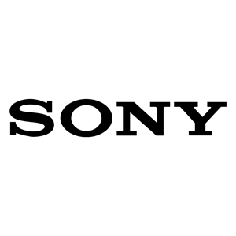

# Sony

- [Sony China](https://www.sony.com.cn/)

## The Development and Opportunities of Sony Corporation

Sony Corporation, a symbol of Japanese innovation and creativity, has played a significant role in shaping the global electronics and entertainment industries. From its humble beginnings after World War II to its current position as a diversified multinational conglomerate, Sony’s journey reflects both technological advancement and strategic adaptation. This essay will explore the development of Sony and examine the opportunities that lie ahead in a rapidly changing world.

To begin with, Sony’s development has always been closely tied to innovation. Founded in 1946, the company initially focused on producing simple electronic devices, but it quickly gained global recognition through groundbreaking products such as the **Walkman**, which transformed personal music consumption, and the **Trinitron** television, which set new standards for display quality. These innovations not only enhanced Sony’s reputation but also established it as a pioneer in consumer electronics. In later decades, Sony successfully expanded into entertainment, acquiring companies like Columbia Pictures and launching the PlayStation series, which became a cornerstone of the global gaming industry.

However, Sony’s growth has not been without challenges. In the early 2000s, the company struggled to maintain its competitiveness amid rapid digitalization and rising competition from firms such as Samsung and Apple. Product divisions operated independently, which led to inefficiency and a lack of coordination. Fortunately, in recent years, Sony has undergone significant restructuring, focusing on its core strengths in gaming, image sensors, and entertainment content. The success of the PlayStation 5 and the dominance of Sony’s camera sensors in smartphones have revitalized its global image.

Looking ahead, Sony faces a variety of promising opportunities. The increasing demand for **virtual reality (VR)** and **artificial intelligence (AI)** offers new growth prospects, especially given Sony’s expertise in hardware and interactive entertainment. Moreover, the rise of streaming services and digital media consumption allows Sony to leverage its vast library of films and music. Additionally, the global emphasis on sustainability and green manufacturing provides a chance for Sony to demonstrate corporate responsibility and strengthen its brand identity.

In conclusion, Sony’s remarkable development has been driven by a relentless pursuit of innovation and adaptability in the face of technological change. Although it has experienced setbacks, its renewed focus on synergy among its business divisions and investment in emerging technologies ensures a promising future. Ultimately, Sony’s story exemplifies how a company can sustain its relevance by balancing creativity, resilience, and strategic foresight.