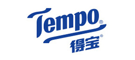

# Tempo

- [https://www.vinda.com/](https://www.vinda.com/)

## The Development History of Tempo and Its Growth in China

Tempo, known in Chinese as _得宝_, is one of the world’s most recognizable brands of premium tissue paper. Its history reflects the evolution of modern hygiene habits and the rise of quality-oriented lifestyles in both Europe and Asia. From its early beginnings in Germany to its remarkable success in China, Tempo’s story is a fascinating example of how a simple everyday product can become a symbol of comfort and trust.

The brand was born in Germany in 1929, during a time when paper tissues were still a novelty. Before that, people commonly used handkerchiefs made of cloth. Tempo revolutionized personal hygiene by introducing disposable tissues that were soft, clean, and convenient. The name “Tempo,” which means “time” or “tempo” in Italian, symbolized modern speed and efficiency — values that perfectly matched the lifestyle of a rapidly industrializing Europe. Over the following decades, Tempo became a household name, associated with quality, reliability, and a touch of elegance.

As living standards improved after World War II, Tempo expanded across Europe and later to other parts of the world. The company focused on research and innovation, developing multi-layered tissues that combined softness with strength. Its iconic blue packaging and distinctive logo became instantly recognizable, helping it stand out in a competitive market. By the late twentieth century, Tempo had successfully established itself as a premium brand, representing both practicality and refinement.

Tempo entered the Chinese market in the mid-1990s, at a time when China’s consumer culture was undergoing rapid transformation. The country’s growing middle class began to value personal hygiene, convenience, and brand reputation — factors that perfectly aligned with Tempo’s strengths. However, success was not immediate. Local competitors offered cheaper alternatives, and the idea of paying more for tissues seemed unnecessary to many consumers. To adapt, Tempo localized its marketing strategy, emphasizing not just functionality but also emotional connection — portraying its tissues as a symbol of care, family warmth, and modern lifestyle.

Over the years, Tempo’s strategy has proven remarkably effective. It has worked closely with local partners, adjusted its product design to suit Chinese preferences, and introduced a wider variety of items such as pocket tissues, wet wipes, and kitchen rolls. Advertising campaigns often feature heartwarming themes of love, health, and everyday happiness, appealing strongly to younger and urban audiences. The brand’s image of _“soft yet strong”_ has become deeply embedded in Chinese consumers’ minds, distinguishing Tempo from other imported and domestic brands.

In recent years, Tempo has also embraced digital transformation in China. Through cooperation with major e-commerce platforms like Tmall and JD.com, the brand has built a strong online presence, offering convenient delivery and exclusive promotions. Furthermore, Tempo’s focus on sustainability — such as using environmentally friendly materials and reducing plastic packaging — has resonated with China’s increasingly eco-conscious consumers.

Today, Tempo is not only a successful international brand but also a beloved name in many Chinese households. It represents a lifestyle that values quality, health, and emotional well-being. From its humble beginnings in Germany nearly a century ago to its thriving presence in modern China, Tempo’s journey demonstrates how a brand can evolve by combining global expertise with local understanding.

In conclusion, the story of Tempo is more than a tale of business expansion — it is a reflection of changing cultural values and rising living standards. Its success in China highlights the importance of innovation, sensitivity to consumer needs, and the ability to blend tradition with modernity. In a world that increasingly values comfort and care, Tempo continues to remind people that even the simplest things can bring lasting satisfaction.